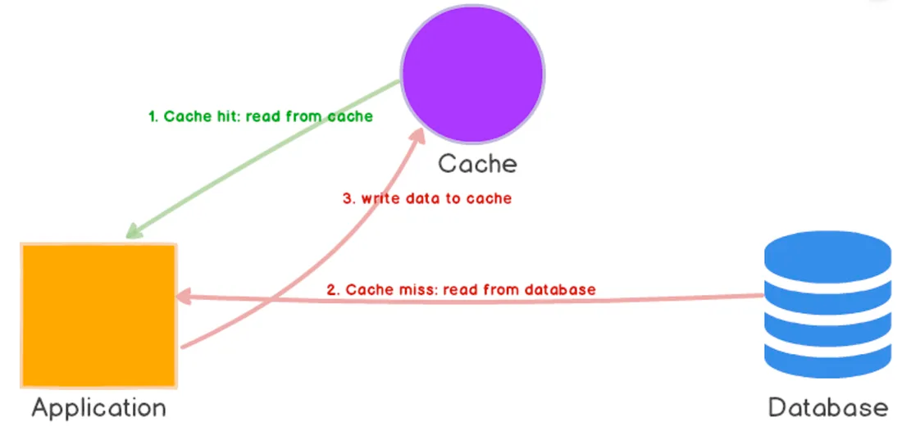
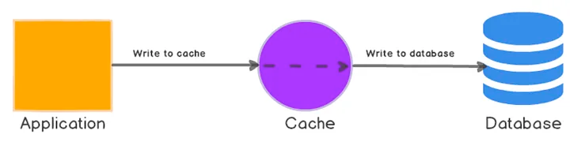
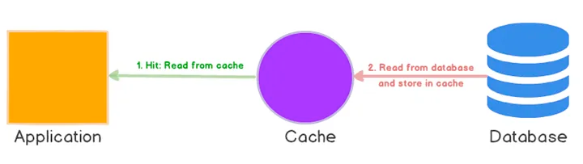

# Compararea strategiilor de caching și impactul lor asupra performanței

Acest proiect compară trei strategii de caching distribuit utilizând Redis:
```
1.	Cache-Aside
2.	Write-Through
3.	Read-Through
```

Scopul este evaluarea comportamentului fiecărei strategii în termeni de performanță, consistență și utilizare, printr-un benchmark controlat.

## Strategii implementate

### 1. Cache-Aside



Mecanism:
```
• La citire: aplicația verifică Redis → dacă există, returnează; dacă nu, citește din DB și scrie în Redis.
• La scriere: actualizarea se face în DB, iar intrarea din Redis se invalidează.
```
### 2. Write-Through



Mecanism:
```
Mecanism
• La scriere: aplicația scrie simultan în DB și în Redis.
• La citire: se citește exclusiv din Redis.
```

### 3. Read-Through



Mecanism
```
• Aplicația citește din cache; dacă nu există, cache-ul în sine își procură datele din DB și le stochează.
• Scrierea se face în DB sau se integrează cu write-through.
```

## Metrici urmărite
```aiignore
• Latență: măsurată la citiri și scrieri prin load-testing.
• Throughput: cereri/s la același nivel de încărcare.
• Cache hit ratio: hits / (hits + misses), colectat din loguri/metrici Redis.
• Warm-up time: timpul până la depășirea pragului de 80% hit-rate.
• Resurse consumate: CPU, memorie, trafic rețea (Prometheus + Grafana).
• Consistență: „staleness” – întârzierea până la propagarea actualizărilor în cache.
```