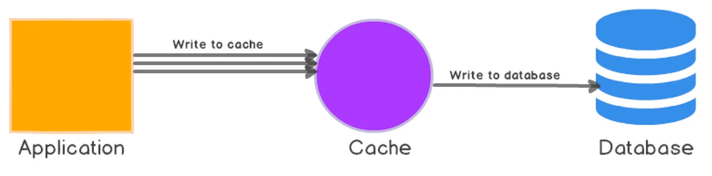

# Caching Strategies Performance Comparison

A comprehensive comparison of different caching strategies (No-Caching, Cache-Aside, Write-Through, and Write-Behind) using Node.js, MySQL, and Redis for distributed caching.

## Overview

This project demonstrates and benchmarks four different caching strategies to help understand their performance characteristics, trade-offs, and use cases:

1. **No-Caching**: Baseline - all operations go directly to the database
2. **Cache-Aside (Lazy Loading)**: Application manages cache; reads check cache first, writes invalidate cache
3. **Write-Through**: Writes go to both cache and database synchronously
4. **Write-Behind (Write-Back)**: Writes go to cache immediately, database asynchronously

## Architecture

```
┌─────────────────┐  ┌─────────────────┐  ┌─────────────────┐  ┌─────────────────┐
│  No-Caching     │  │  Cache-Aside    │  │  Write-Through  │  │  Write-Behind   │
│  Service        │  │  Service        │  │  Service        │  │  Service        │
│  :3000          │  │  :3001          │  │  :3002          │  │  :3003          │
└────────┬────────┘  └────────┬────────┘  └────────┬────────┘  └────────┬────────┘
         │                    │                    │                    │
         │                    │                    │                    │
         └────────────────────┴────────────────────┴────────────────────┘
                              │                   │
                    ┌─────────┴─────────┐ ┌───────┴────────┐
                    │   MySQL Database  │ │  Redis Cache   │
                    │   :3306           │ │  :6379         │
                    └───────────────────┘ └────────────────┘
```

## Getting Started

### Prerequisites

- Docker & Docker Compose
- Node.js 18+ (for local development)
- 8GB+ RAM recommended

### Installation

1. **Clone the repository**
    ```bash
    git clone https://github.com/stefanmihalache/SASPS.git
    ```

2. **Install dependencies**
   ```bash
   npm install
   ```

3. **Start all services with Docker**
   ```bash
   docker-compose up -d
   ```

   This will start:
   - MySQL database (port 3306)
   - Redis cache (port 6379)
   - No-Caching service (port 3000)
   - Cache-Aside service (port 3001)
   - Write-Through service (port 3002)
   - Write-Behind service (port 3003)

4. **Check services health**
   ```bash
   curl http://localhost:3000/api/health
   curl http://localhost:3001/api/health
   curl http://localhost:3002/api/health
   curl http://localhost:3003/api/health
   ```

## Caching Strategies Explained

### 1. No-Caching (Baseline)
**How it works:**
- All read requests go directly to the database
- All write requests go directly to the database
- No intermediate caching layer

**Pros:**
- Simple implementation
- No cache consistency issues
- Always fresh data

**Cons:**
- Highest database load
- Slowest response times
- No scalability benefits

**Use cases:**
- Baseline for comparison
- Systems with minimal read traffic
- Data that changes very frequently

### 2. Cache-Aside


**How it works:**
- **Read**: Check cache → if miss, load from DB and populate cache
- **Write**: Update DB → invalidate cache entries
- Application explicitly manages cache

**Pros:**
- Only requested data is cached (memory efficient)
- Cache failures don't crash the system
- Easy to implement

**Cons:**
- First request is always slow (cache miss)
- Stale data possible until cache expiry
- Cache invalidation complexity

**Use cases:**
- Read-heavy workloads
- Data that doesn't change frequently
- When cache failures should be tolerable
- 
### 3. Write-Through


**How it works:**
- **Read**: Check cache → if miss, load from DB and populate cache
- **Write**: Write to cache AND database synchronously
- Cache always in sync with database

**Pros:**
- Cache always consistent with DB
- No stale data issues
- Predictable behavior

**Cons:**
- Slower writes (two operations)
- Writes to cache even if data not read
- Higher write latency

**Use cases:**
- Systems requiring strong consistency
- Write-once, read-many patterns
- When data integrity is critical

### 4. Write-Behind



**How it works:**
- **Read**: Check cache → if miss, load from DB and populate cache
- **Write**: Write to cache immediately → queue DB write for later
- Background process flushes writes to DB

**Pros:**
- Fastest write performance
- Reduced database load
- Can batch multiple writes

**Cons:**
- Risk of data loss if cache crashes
- Temporary inconsistency between cache and DB
- More complex implementation

**Use cases:**
- Write-heavy workloads
- Systems tolerating eventual consistency
- High-throughput requirements
- When write performance is critical

## Running Load Tests

The project includes a comprehensive load testing suite using `autocannon`.

### Run all tests
```bash
npm run load-test
```

### Test scenarios

1. **Read Test** (30s, 50 connections)
   - GET /api/products/:id (random IDs)
   - GET /api/products?limit=50
   - GET /api/customers/:id (random IDs)

2. **Write Test** (10s, 20 connections)
   - PUT /api/products/:id (update operations)

3. **Mixed Test** (30s, 40 connections)
   - 70% read operations
   - 20% list queries
   - 10% write operations

### Results

Test results are saved to `load-test-results-<timestamp>.json` and include:
- Requests per second (throughput)
- Average latency
- P99 latency
- Cache hit rates
- Cache misses
- Error rates

## API Endpoints

All services expose the same REST API:

### Health & Stats
```bash
GET  /api/health          # Service health check
GET  /api/stats           # Performance statistics
POST /api/stats/reset     # Reset statistics and flush cache
```

### Products
```bash
GET    /api/products           # Get all products (limit param)
GET    /api/products/:id       # Get product by ID
PUT    /api/products/:id       # Update product
POST   /api/products           # Create product
DELETE /api/products/:id       # Delete product
```

### Customers
```bash
GET /api/customers        # Get all customers
GET /api/customers/:id    # Get customer by ID
```

### Orders
```bash
GET /api/orders/:id       # Get order with details
```

### Example Requests

```bash
# Get a product (check cache behavior)
curl http://localhost:3001/api/products/S10_1678

# Get statistics
curl http://localhost:3001/api/stats

# Update a product
curl -X PUT http://localhost:3002/api/products/S10_1678 \
  -H "Content-Type: application/json" \
  -d '{
    "productName": "Updated Product",
    "quantityInStock": 1000,
    "buyPrice": 99.99,
    "MSRP": 199.99
  }'

# Trigger write-behind flush
curl -X POST http://localhost:3003/api/flush
```

## Performance Metrics

Each service tracks:

- **reads**: Total read operations
- **writes**: Total write operations
- **cacheHits**: Cache hits (not applicable for no-caching)
- **cacheMisses**: Cache misses
- **cacheHitRate**: Hit rate percentage
- **avgResponseTime**: Average response time
- **queuedWrites**: Pending writes (write-behind only)
- **flushedWrites**: Completed async writes (write-behind only)

## Monitoring

### View service logs
```bash
# All services
docker-compose logs -f

# Specific service
docker-compose logs -f cache-aside
docker-compose logs -f write-behind
```

### Check Redis cache
```bash
docker exec -it redis redis-cli
> KEYS *
> GET "cache-aside:product:S10_1678"
> FLUSHALL
```

### Check MySQL database
```bash
docker exec -it db mysql -u user -ppass testdb
> SELECT * FROM products LIMIT 10;
> SELECT COUNT(*) FROM products;
```

## Cleanup

```bash
# Stop all services
docker-compose down

# Stop and remove volumes (clears database)

docker-compose down -v

# Remove all containers and images
docker-compose down --rmi all -v
```

## Expected Results

Based on typical workloads:

### Read-Heavy Workload
1. **Cache-Aside**: Best overall (high hit rate after warm-up)
2. **Write-Through**: Similar to cache-aside
3. **Write-Behind**: Similar to cache-aside
4. **No-Caching**: Slowest (every request hits DB)

### Write-Heavy Workload
1. **Write-Behind**: Fastest (async DB writes)
2. **Cache-Aside**: Medium (DB write + cache invalidation)
3. **Write-Through**: Slower (dual writes)
4. **No-Caching**: Medium (direct DB writes)

### Mixed Workload
1. **Write-Behind**: Best for high throughput
2. **Cache-Aside**: Good balance
3. **Write-Through**: Consistent but slower writes
4. **No-Caching**: Highest DB load

## Tips for Testing

1. **Warm up the cache**: Run some requests before testing to populate cache
2. **Test cache hits**: Make repeated requests to same resources
3. **Test cache misses**: Request different resources each time
4. **Monitor resources**: Watch CPU, memory, and network usage
5. **Check consistency**: Verify data matches between cache and DB